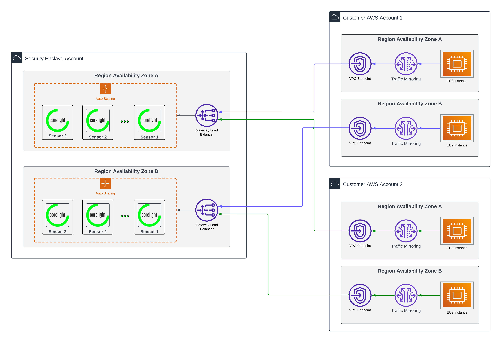

# terraform-aws-sensor

Terraform for Corelight's AWS Cloud Sensor Deployment.



## Usage
```terraform

data "aws_subnet" "management" {
  for_each = toset(["<management subnet id 1>", "<management subnet id 2>"])
  id       = each.value
}

module "asg_lambda_role" {
  source = "github.com/corelight/terraform-aws-sensor//modules/iam/lambda"

  lambda_cloudwatch_log_group_arn = module.sensor.cloudwatch_log_group_arn
  sensor_autoscaling_group_arn    = module.sensor.autoscaling_group_arn
  security_group_arn              = module.sensor.management_security_group_arn
  subnet_arn                      = values(data.aws_subnet.management)[0].arn
}

module "sensor" {
  source = "github.com/corelight/terraform-aws-sensor"

  # Multi-AZ support: provide one subnet per availability zone
  # The ASG will automatically distribute instances across AZs
  availability_zones = ["us-east-1a", "us-east-1b"]
  aws_key_pair_name = "<key pair name>"

  # Request access to Corelight sensor AMI from you Account Executive
  corelight_sensor_ami_id = "<sensor AMI ID>"
  license_key = "<your Corelight sensor license key>"

  # Provide one management subnet per AZ (must match availability_zones order)
  management_subnet_ids = ["<management subnet in us-east-1a>", "<management subnet in us-east-1b>"]

  # Provide one monitoring subnet per AZ (must match availability_zones order)
  monitoring_subnet_ids = ["<monitoring subnet in us-east-1a>", "<monitoring subnet in us-east-1b>"]

  community_string = "<password for the sensor api>"
  vpc_id = "<vpc where the sensor autoscaling group is deployed>"
  asg_lambda_iam_role_arn = module.asg_lambda_role.role_arn

  fleet_token = "<the pairing token from the Fleet UI>"
  fleet_url   = "<the URL of the fleet instance from the Fleet UI>"
  fleet_server_sslname = "<the ssl name provided by Fleet>"
}


### Optional resources for enrichment
module "enrichment_sensor_role" {
  source = "github.com/corelight/terraform-aws-enrichment//modules/iam/sensor"
  enrichment_bucket_arn = data.aws_s3_bucket.enrichment_bucket.arn
}

resource "aws_iam_instance_profile" "corelight_sensor" {
  name = "<name of the instance profile>"
  role = module.enrichment_sensor_role.sensor_role_name
}
```

### Deployment

The variables for this module all have default values that can be overwritten
to meet your naming and compliance standards.

Deployment examples can be found [here][].

[here]: https://github.com/corelight/corelight-cloud/tree/main/terraform/aws-autoscaling-sensor

## License

The project is licensed under the [MIT][] license.

[MIT]: LICENSE

